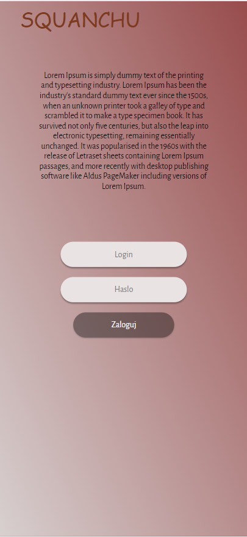

# SQUANCHU
***
Projekt WDPAI.  
Apliakcja służąca do wyszukiwania korepetytorów po podaniu swojego miasta oraz szukanego przedmiotu.  
Aplikacja podzielona zarówno na profil nauczyciela jak i studenta.  
Student po wyszukaniu korepetytora, może zapisać się na zajęcia w czasie dostępności nauczyciela.

## Przykładowe widoki aplikacji
1. Ekran logowania

2. Profil studenta

3. Widok dodawania dyspozycji przez nauczyciela

##Kryteria ewaluacji projektu
***
1. Dokumentacja w pliku README.md
2. Część backendowa została napisana obiektowo
3. Diagram ERD

4. Systematyczne commity projektu
5. Zrealizowane widoki przesłane w zgłoszeniu, dodałem również kilka dodatkowych widoków 
6. HTML - widoki umieszczone w szablonach headerwithprofile.php, brak powtarzalności kodu
7. Połączenie z bazą PostgreSQL, połączenie poprzez PDO
8. Złożoność bazy danych, nie wystepują anomalia modyfikacji i usunięć.
9. Wersja php 7.4.3
10. Zastosowanie języka JavaScript, wysyłanie i pobieranie danych
11. Wykorzystanie FETCH API metody POST
12. Design - klasy css, brak mieszania styli w HTML i CSS
13. Strony są responsywne, działające pod różnymi urządzeniami wybranymi z narzędzi deweloperskich przeglądarki
14. Logowanie - zastosowano proces logowania oparty o bazę danych, hashowanie hasła
15. Sesja oparta o zmienną $_SESSION
16. Uprawnienia użytkowników - student oraz nauczyciel, różne możliwości
17. Role użytkowników - student, nauczyciel
18. Wylogowywanie - usunięcie sesji
19. Akcje na referencjach - w zapytaniach zastosowano joiny
20. Bezpieczeństwo - hasła są chronione
21. Brak replikacji kodu
22. Czystość i przejrzystość kodu
23. Baza danych zrzucona do pliku .sql
